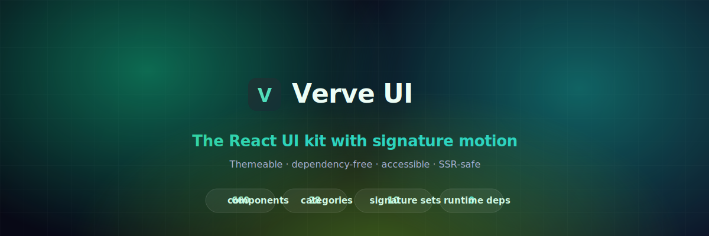

<div align="center">

<a href="https://lucas-vdr-a11y.github.io/verve-ui/">
  
</a>

# Verve UI

**A modern, themeable React + TypeScript component library — with signature motion.**

660 components across 28 categories. Zero runtime dependencies beyond React,
fully token-driven, light/dark out of the box, accessible and SSR-safe by default.

[](LICENSE)
&nbsp;[](docs/COMPONENTS.md)
&nbsp;[](docs/COMPONENTS.md)
&nbsp;[](https://react.dev)
&nbsp;[](https://www.typescriptlang.org)
&nbsp;[](package.json)

### [▶&nbsp; Live demo &amp; component overview ↗](https://lucas-vdr-a11y.github.io/verve-ui/)

[🎬 Launch film](https://lucas-vdr-a11y.github.io/verve-ui/launch.html) · [📖 Component index](docs/COMPONENTS.md) · [🚀 v0.1.0 release](https://github.com/Lucas-vdr-a11y/verve-ui/releases/tag/v0.1.0)

</div>

```bash
npm install @verve/ui
```

```tsx
import { Button, Card, Stack, useToast } from "@verve/ui";
import "@verve/ui/styles.css";

export function Example() {
  return (
    <Stack gap="4">
      <Card variant="elevated" padding="6">
        <Button variant="solid" tone="primary">Get started</Button>
      </Card>
    </Stack>
  );
}
```

## ✨ Highlights

- **660 components, 28 categories** — from everyday inputs, tables and charts to
  the distinctive stuff: aurora backgrounds, beams, particles, kinetic
  typography, pointer-driven flair, device mockups and 3D perspective cards.
- **Signature motion, zero dependencies** — every animation is hand-built with
  CSS, `requestAnimationFrame`, canvas, SVG and `IntersectionObserver`. No
  framer-motion, no three.js.
- **Token-driven theming** — light & dark out of the box; override any `--nova-*`
  variable to rebrand the whole set.
- **Accessible & SSR-safe** — real semantics, keyboard support, focus-visible
  rings, guarded browser access, and `prefers-reduced-motion` respected
  throughout.
- **Typed** — every component ships an exported `Props` type.

## Theming

Wrap your app in an element with `class="nova-root"` and `data-theme="light|dark"`.
Every component reads from semantic CSS custom properties defined in
`src/styles/tokens.css`. Override any `--nova-*` token to rebrand the whole set —
change `--nova-brand-600` and every primary surface follows.

```html
<div class="nova-root" data-theme="dark">…</div>
```

## Design principles

- **Tokens only** — no hard-coded colors, spacing, radii, or motion. One source
  of truth, retheme by overriding variables.
- **Composable** — compound components (`Tabs`, `Card`, `Accordion`, `Table`)
  over giant prop lists.
- **Accessible** — correct semantics, full keyboard support, focus-visible rings,
  wired `aria-*` state.
- **SSR-safe** — all `window`/`document` access guarded inside effects.
- **Typed** — every component ships an exported `Props` type.

See [CONTRACT.md](CONTRACT.md) for the full authoring contract.

## Categories

**660 components across 28 categories** — every one token-driven, typed, accessible and SSR-safe. Categories marked ✨ are the distinctive, motion-driven "signature" components (Aceternity / Magic-UI flavour). Manifest: [docs/components.json](docs/components.json) · index: [docs/COMPONENTS.md](docs/COMPONENTS.md).

| Category | Count | Components |
| --- | --- | --- |
| **Inputs & Forms** | 57 | AutosizeInput, Button, Calendar, CardForm, Cascader, Checkbox, ColorPicker, ColorWheel, Combobox, CreditCardInput, CurrencyInput, CvvInput, DatePicker, DateRangePicker, DurationSlider, Editable, EmojiPicker, EmojiRating, ExpiryInput, FieldGroup, FileDropzone, Form, FormField, GradientPicker, IconPicker, ImageCardSelect, Input, Knob, LikertScale, MaskedInput, Mentions, MultiSelect, NpsScale, NumberInput, OtpResendTimer, PasswordInput, PhoneInput, PinInput, PostalCodeInput, Radio, RangeSlider, Rating, RichTextEditor, SearchInput, SegmentedControl, Select, SignaturePad, Slider, SliderMarks, Switch, TagInput, Textarea, TimePicker, Toggle, ToggleChipGroup, ToggleGroup, TransferList |
| **Layout** | 28 | Affix, AppShell, Bleed, Box, ButtonGroup, Card, CardGrid, Center, Cluster, Container, Divider, Flex, Footer, Frame, Grid, Hero, Masonry, PageHeader, Panel, Resizable, ScrollArea, Section, SimpleGrid, Spacer, Split, Stack, Sticky, Toolbar |
| **Navigation** | 29 | Anchor, AnimatedHamburger, AppSwitcher, BottomNav, Breadcrumbs, CommandPalette, Dock, ExpandableSearch, FilterBar, FloatingActionMenu, GooeyNav, MegaMenu, Menu, MorphMenu, NavList, Navbar, PageNav, Pagination, PillTabs, ScrollNav, ScrollToTop, SegmentedTabs, Sidebar, Steps, TabBar, Tabs, TreeNav, TubelightNav, Wizard |
| **Feedback** | 26 | Alert, Badge, Banner, Callout, Confetti, Countdown, DotsLoader, Indicator, InlineMessage, LoadingBar, LoadingOverlay, Meter, NotificationCard, Progress, ProgressCircle, ProgressList, ProgressSteps, RatingFeedback, Result, Ribbon, Skeleton, SkeletonPresets, Spinner, StatusIndicator, Tooltip, Watermark |
| **Data Display** | 44 | AnimatedCounter, Avatar, AvatarGroup, CalendarHeatmap, CodeBlock, CodeDiff, ColorPalette, ComparisonTable, DataList, DataTable, DescriptionList, EditableTable, EmptyState, EventCalendar, Feed, FileTree, GanttChart, HeatGrid, InfiniteScroll, JsonViewer, KanbanBoard, KbdGroup, Leaderboard, List, MetricCard, OrgChart, PivotTable, ProgressRing, ProgressTracker, PropertyList, RatingDisplay, ResizableTable, Stat, StatGroup, Statistic, Table, TableToolbar, Tag, TagCloud, Timeline, TreeDiagram, TreeTable, TrendBadge, VirtualList |
| **Typography** | 20 | Abbr, AnchorHeading, Blockquote, Caption, Code, Emphasis, Glossary, GradientText, Heading, Highlighter, Kbd, Lead, Link, Mark, NumberFormat, Prose, PullQuote, Text, TextList, Truncate |
| **Text Effects ✨** | 37 | AuroraText, BlurFadeText, BoxReveal, CircularText, ColourfulText, CountingNumber, DecryptedText, FallingText, FlipText, FlipWords, GlitchText, GradientUnderline, HighlightSweep, HyperText, LineShadowText, MorphingText, NeonText, OutlineText, PointerHighlight, RotatingText, ScrambleHover, ScrambleIn, ScrollTextReveal, ShimmerHeading, ShinyGradientHeading, ShinyText, SparklesText, SplitFlapText, StaggerReveal, TextGenerateEffect, TextHoverFill, TextReveal, TrueFocus, TypingLoop, VariableProximity, WavyText, WordRotate |
| **Overlay** | 16 | AlertDialog, Backdrop, ConfirmDialog, ContextMenu, Drawer, FloatingActionButton, HoverCard, Lightbox, Modal, Popover, Sheet, Snackbar, SpeedDial, Spotlight, Toast, Tour |
| **Disclosure** | 9 | Accordion, Collapsible, DetailsGroup, Disclosure, ExpandableCard, FAQ, ReadMore, Spoiler, TreeView |
| **Media** | 21 | AspectRatio, AudioPlayer, AudioWaveform, AvatarUploader, BackgroundMedia, Carousel, Figure, Gallery, Icon, Image, ImageCompare, ImageMasonry, ImagePlaceholder, ImageZoom, MediaObject, PlayButton, SeekBar, Thumbnail, VideoCard, VideoPlayer, VolumeControl |
| **Motion** | 9 | Collapse, Fade, Marquee, Ripple, Scale, Slide, Stagger, Transition, Typewriter |
| **FX / Backgrounds ✨** | 32 | AnimatedGradientBorder, AnimatedGridPattern, AuroraBackground, AuroraRibbons, BackgroundBoxes, Beams, BeamsCollision, BorderBeam, CanvasRevealEffect, ConcentricRings, DotPattern, DottedGlobe, FloatingShapes, GlowingStars, GradientAnimation, GridPattern, HexPattern, InteractiveGridPattern, LampGlow, Meteors, NoiseOverlay, Particles, PlasmaField, RetroGrid, RippleBackground, ShineBorder, ShootingStars, SpotlightCorners, SpotlightGlow, StarsBackground, Vortex, WarpBackground |
| **Flair (interactive) ✨** | 47 | AnimatedModal, AnimatedTooltipGroup, BookmarkButton, BorderTrail, CanvasRevealCard, CardStack, CheckboxMorph, CometCard, ConfettiButton, CopyButton, DayNightToggle, DirectionAwareHover, DraggableCardBody, ElasticSlider, EvervaultCard, FlipCard, FocusCards, GlareCard, GlowingEffectBorder, GooeyButton, GradientCard, HoverBorderGradient, HoverRevealText, InfiniteMovingCards, Lens, LikeButton, LiquidToggle, MagneticButton, MovingBorderButton, MultiStepLoader, ParallaxTiltImage, PinContainer, PowerButton, PulsatingButton, RippleButton, SaveButton, ScratchToReveal, ShimmerButton, SpotlightCard, StarToggle, StickyNoteCard, SubscribeButton, SwipeCards, ThreeDButton, ThumbsToggle, TiltCard, WobbleCard |
| **Cursor FX ✨** | 9 | BlobCursor, CursorFollower, CursorGlow, CustomCursor, EmojiCursor, MagneticCursor, SpotlightCursor, TextCursor, TrailCursor |
| **Loaders ✨** | 24 | AiThinkingLoader, BatteryLoader, BlobLoader, BouncingBalls, ClockLoader, CometLoader, DnaLoader, FlipBoxLoader, GooeyLoader, HeartbeatLoader, InfinityLoader, MatrixRainLoader, MorphingLoader, OrbitLoader, PacmanLoader, ProgressDots, ProgressOrb, PulseGridLoader, RingsLoader, RippleLoader, SpiralLoader, SquareLoader, TextShimmerLoader, WaveLoader |
| **Showcase ✨** | 36 | AnimatedBeamConnect, AnimatedList, BentoGrid, CardHoverGrid, CardsCarousel, CompareReveal, ContainerScroll, ExpandableFeatureCards, FeatureSpotlightTabs, FeatureSteps, FollowingPointerCard, GeminiBeam, GlowMenu, HeroHighlight, HorizontalScrollSection, ImageAccordion, ImageTrail, LampHeader, LayoutGridExpand, LogoOrbit, MarqueeRow, MaskedTextReveal, ParallaxScrollColumns, PinnedSectionReveal, ScrollProgress, ScrollReveal, ScrollTimeline, ScrollVelocitySkew, SpotlightCardGrid, SpotlightFeatureCard, StackingCards, StickyScrollReveal, TestimonialsMarquee, ThreeDMarquee, TracingBeam, ZoomParallax |
| **Device Mockups ✨** | 8 | BrowserFrame, CodeWindow, DeviceShowcase, MacbookFrame, PhoneFrame, TabletFrame, TerminalWindow, WindowFrame |
| **Patterns / Dividers ✨** | 12 | AnimatedBlob, BlobShape, CirclePattern, CrossPattern, CurveDivider, DotGridShape, GradientBlob, MeshGradient, SlantDivider, Squiggle, WaveDivider, ZigzagDivider |
| **3D / Perspective ✨** | 9 | CardCarousel3D, Coverflow, FlipBox, FloatingCube, FoldCard, IsometricCard, ParallaxLayers, PerspectiveCardStack, RotatingPrism |
| **Gamification ✨** | 12 | AchievementBadge, ComboMeter, DailyRewardRow, LevelBadge, ProgressMilestones, ProgressQuest, RankBadge, RewardCard, ScoreCounter, SpinWheel, StreakCounter, XpProgressBar |
| **Charts** | 21 | ActivityRings, AreaChart, BarChart, BoxPlot, BulletChart, CandlestickChart, ComboChart, DonutChart, Funnel, GaugeChart, Heatmap, Histogram, LineChart, PieChart, RadarChart, RadialBarChart, ScatterChart, Sparkline, StackedBarChart, Treemap, WaterfallChart |
| **Blocks** | 28 | AnnouncementBar, BlogPostCard, CTABanner, ContactForm, EmptyCard, EventCard, FaqSection, FeatureCard, FeatureGrid, FileCard, HeroSection, KpiCard, LoginForm, LogoCloud, NewsletterCTA, NewsletterSignup, NotificationItem, OnboardingChecklist, PricingCard, PricingTable, ProductCard, ProfileCard, SignupForm, StatCard, StatsRow, TeamMemberCard, TestimonialCard, TimelineSection |
| **Commerce** | 18 | AddToCartButton, CartItem, CheckoutSummary, ColorVariantSelector, CouponInput, DeliveryEstimate, MiniCart, PaymentMethods, PriceTag, ProductGallery, QuantityStepper, RatingSummary, ReviewCard, ShippingTracker, SizeSelector, StockBadge, VariantSelector, WishlistButton |
| **Chat / Messaging** | 16 | ChatAttachment, ChatBubble, ChatComposerToolbar, ChatHeader, ChatInput, ChatMessageList, ChatScrollButton, CodeMessage, ConversationList, MessageActions, MessageReactions, PromptBox, StreamingText, SuggestionChips, TypingIndicator, VoiceMessage |
| **Scheduling** | 9 | AgendaView, DayView, DurationSelect, MiniCalendar, Scheduler, TimeSlotPicker, TimezonePicker, WeekView, YearView |
| **Drag & Drop** | 9 | DragHandle, DragScroll, Draggable, DropZone, Droppable, KanbanDnd, Sortable, SortableGrid, SortableTabs |
| **Page Templates** | 8 | AuthLayout, BlankCenteredLayout, DashboardLayout, DocsLayout, ErrorLayout, MarketingLayout, SettingsLayout, SplitAuthLayout |
| **Utility (hooks & primitives)** | 66 | ClickAwayListener, ClientOnly, ColorModeScript, FocusTrap, LiveRegion, NoSsr, Portal, Show, SkipLink, ThemeProvider, ThemeToggle, VisuallyHidden, useAnnouncer, useClipboard, useControllableState, useCookie, useCounter, useDebouncedCallback, useDebouncedValue, useDisclosure, useDocumentTitle, useElementSize, useEventCallback, useEventListener, useFavicon, useFirstMountState, useFocusWithin, useForceUpdate, useFullscreen, useGeolocation, useHotkeys, useHover, useId, useIdle, useIntersectionObserver, useInterval, useIsomorphicLayoutEffect, useLatest, useList, useLocalStorage, useLongPress, useMap, useMediaQuery, useMergedRefs, useMount, useNetworkState, usePrevious, useQueue, useReducedMotion, useRenderCount, useScrollDirection, useScrollLock, useScrollPosition, useSessionStorage, useSet, useStateHistory, useStep, useThrottledCallback, useThrottledValue, useTimeout, useToggle, useUnmount, useUnmountEffect, useUpdateEffect, useWindowScroll, useWindowSize |

## Development

```bash
npm install
npm run dev        # playground at /demo
npm run typecheck  # strict tsc
npm run build      # library bundle → dist/
```

## Contributing

Contributions are welcome. Every component follows a strict authoring contract —
its own folder, `nova-` BEM classes, `forwardRef`, an exported `Props` type,
semantic tokens only, and SSR-safety. Read **[CONTRACT.md](CONTRACT.md)** before
opening a PR.

```bash
npm run check          # type-check the library + demo site
npm run docs           # regenerate the component manifest + catalog
```

The component index in [docs/COMPONENTS.md](docs/COMPONENTS.md) and the site's
category overview are generated from the source tree — run `npm run docs` after
adding a component so they stay accurate.

## License

[MIT](LICENSE) © Verve UI contributors
